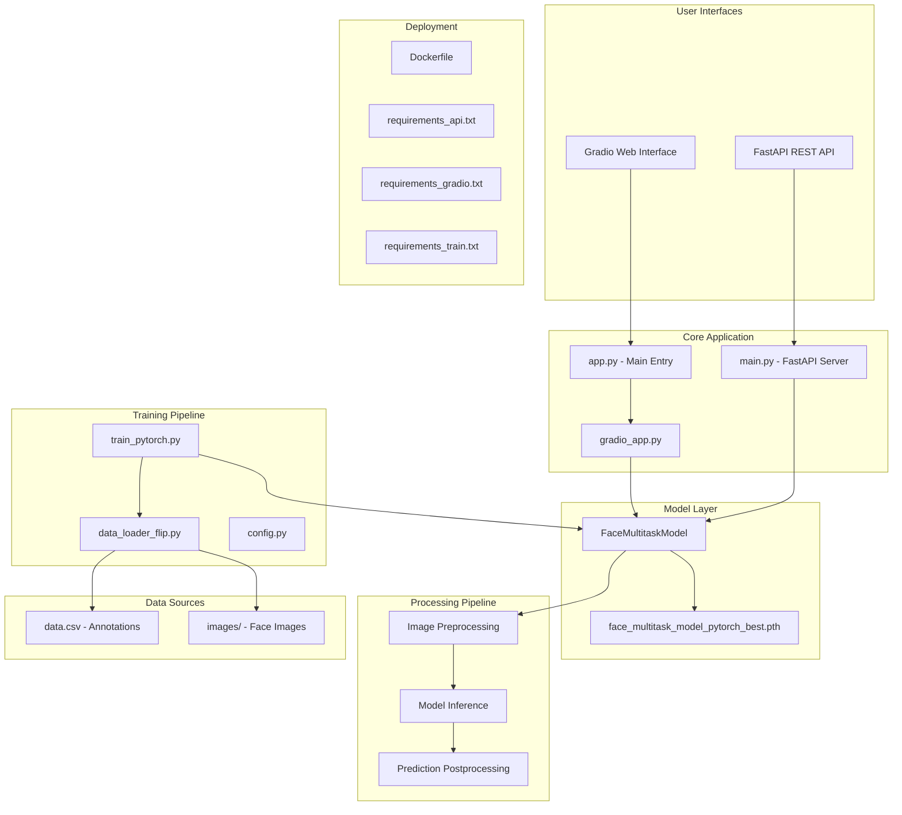

# Face Attribute Prediction System

## Executive Summary

This repository implements a comprehensive face attribute prediction system that uses deep learning to analyze facial images and predict age, gender, and eye coordinates. The system provides both a RESTful API for programmatic access and an interactive Gradio web interface for user-friendly interaction, making it suitable for both developers and end-users who need facial analysis capabilities.

The system is built using PyTorch with a [MobileNetV2](https://arxiv.org/abs/1801.04381) backbone for efficient inference, FastAPI for robust API services, and includes complete training pipelines for model development.

## Architecture Overview



## Module Documentation

### 🚀 Application Layer (`app/`)

#### **Main Entry Points**
- **`app.py`**: Primary entry point for Gradio interface
- **`main.py`**: FastAPI server implementation with `/predict/pytorch` endpoint
- **`gradio_app.py`**: Interactive web interface with real-time prediction and visualization

#### **Core Components**
- **`models_pytorch/`**: Contains the trained model architecture and weights
  - `model_pytorch.py`: MobileNetV2-based multitask neural network
  - `face_multitask_model_pytorch_best.pth`: Pre-trained model weights
- **`utils.py`**: Image preprocessing and prediction postprocessing utilities
- **`schemas.py`**: Pydantic models for API request/response validation
- **`config_api.py`**: Runtime configuration for inference

### 🧠 Model Architecture

The system uses a **multitask learning approach** with three prediction heads:

1. **Age Prediction**: Regression head outputting normalized age (0-1, scaled to 0-100 years)
2. **Gender Classification**: Binary classification with sigmoid activation
3. **Eye Coordinate Regression**: Predicts normalized (x,y) coordinates for left and right eyes

**Base Architecture**: MobileNetV2 (ImageNet pre-trained) with custom task-specific heads

### 🔧 Training Pipeline (`training_scripts/`)

#### **Training Components**
- **`train_pytorch.py`**: Main training script with multi-task loss optimization
- **`data_loader_flip.py`**: Custom dataset loader with horizontal flip augmentation
- **`model_pytorch.py`**: Model definition (identical to inference version)
- **`config.py`**: Training hyperparameters and data paths

#### **Key Features**
- **Data Augmentation**: Horizontal flipping with coordinate adjustment
- **Multi-task Loss Weighting**: Configurable loss weights for balanced training
- **Early Stopping**: Prevents overfitting with validation-based stopping
- **Model Checkpointing**: Saves best model based on validation loss

### 📊 Data Processing

#### **Input Requirements**
- **Images**: RGB face images (resized to 224x224)
- **Annotations**: CSV with columns: `im_name`, `age`, `gender`, `left_eye_x`, `left_eye_y`, `right_eye_x`, `right_eye_y`

#### **Preprocessing Pipeline**
1. Image resizing to 224x224 pixels
2. ImageNet normalization (mean=[0.485, 0.456, 0.406], std=[0.229, 0.224, 0.225])
3. Coordinate normalization to [0,1] range
4. Age normalization to [0,1] range (divided by 100)

## Installation & Setup

### Prerequisites
- Python 3.9+
- CUDA-compatible GPU (optional, CPU inference supported)

### Environment Setup

```bash
# Clone the repository
git clone <repository-url>
cd ricarsaes-bdeo-face-challenge

# For API deployment
pip install -r requirements_api.txt

# For Gradio interface
pip install -r requirements_gradio.txt

# For training
pip install -r requirements_train.txt
```

### Docker Deployment

```bash
# Build Docker image
docker build -t face-attribute-api .

# Run container
docker run -p 8000:8000 face-attribute-api
```

## Usage Examples

### 🌐 FastAPI Server

```bash
# Start the API server
uvicorn app.main:app --host 0.0.0.0 --port 8000

# API will be available at http://localhost:8000
# Interactive docs at http://localhost:8000/docs
```

**API Endpoint Usage:**
```python
import requests

# Predict face attributes
with open('face_image.jpg', 'rb') as f:
    response = requests.post(
        'http://localhost:8000/predict/pytorch',
        files={'file': f}
    )
    
predictions = response.json()
print(f"Age: {predictions['age']} years")
print(f"Gender: {predictions['gender']} ({predictions['gender_confidence']:.2%})")
print(f"Eye coords: {predictions['eye_coordinates']['normalized']}")
```

### 🎨 Gradio Interface

```bash
# Launch interactive interface
python app.py

# Or run directly
python app/gradio_app.py
```

The Gradio interface provides:
- **Image Upload**: Drag-and-drop or file selection
- **Real-time Prediction**: Automatic inference on image change
- **Visual Annotation**: Eye coordinates overlaid on input image
- **Detailed Results**: Age, gender confidence, and coordinate information

### 🔬 Training New Models

```bash
cd training_scripts

# Ensure data is organized:
# data/
# ├── data.csv
# └── images/
#     ├── image1.jpg
#     ├── image2.jpg
#     └── ...

# Start training
python train_pytorch.py
```

**Training Configuration:**
- **Batch Size**: 32
- **Learning Rate**: 1e-4
- **Epochs**: 25 (with early stopping)
- **Loss Weights**: Age: 1.0, Gender: 1.0, Eyes: 5.0

## Configuration

### Key Configuration Parameters

| Parameter | Description | Default |
|-----------|-------------|---------|
| `IMG_HEIGHT`, `IMG_WIDTH` | Input image dimensions | 224x224 |
| `MAX_AGE` | Maximum age for normalization | 100.0 |
| `BATCH_SIZE` | Training batch size | 32 |
| `LEARNING_RATE` | Optimizer learning rate | 1e-4 |
| `DEVICE` | Compute device | Auto-detect |

### Model Configuration
- **Architecture**: MobileNetV2 + Custom heads
- **Input**: RGB images (3, 224, 224)
- **Outputs**: 
  - Age: Single float (normalized)
  - Gender: Single logit
  - Eyes: 4 coordinates [lx, ly, rx, ry] (normalized)

## Dependencies

### Core Dependencies
- **PyTorch** (2.7.1): Deep learning framework
- **torchvision** (0.22.1): Computer vision utilities
- **FastAPI** (0.115.12): Modern web API framework
- **Gradio** (5.33.0): Interactive ML interfaces
- **Pillow** (11.2.1): Image processing
- **Pydantic**: Data validation and settings

### Training Dependencies
- **scikit-learn**: Data splitting and metrics
- **pandas**: Data manipulation
- **tqdm**: Progress bars
- **numpy**: Numerical computing

## API Reference

### Endpoints

#### `POST /predict/pytorch`
Predict face attributes from uploaded image.

**Request:**
- **Content-Type**: `multipart/form-data`
- **Body**: Image file (JPEG, PNG)

**Response:**
```json
{
  "age": 25.3,
  "gender": "female",
  "gender_confidence": 0.8745,
  "eye_coordinates": {
    "normalized": [0.37, 0.51, 0.61, 0.51],
    "pixel_original_ref_approx": [65.9, 111.2, 108.6, 111.2]
  },
  "model_type": "pytorch"
}
```

#### `GET /`
API root endpoint with welcome message.

## Model Performance

The multitask model is trained to optimize:
- **Age Prediction**: Mean Absolute Error (MAE) in years
- **Gender Classification**: Binary accuracy
- **Eye Localization**: Mean Absolute Error in normalized coordinates

**Loss Function**: Weighted combination of L1 (age), BCE (gender), and MSE (eyes) losses.

## Contributing

### Development Setup
1. Install training requirements: `pip install -r requirements_train.txt`
2. Prepare dataset in `data/` directory
3. Configure paths in `training_scripts/config.py`
4. Run training: `python training_scripts/train_pytorch.py`

### Code Structure
- Follow existing naming conventions
- Add type hints for new functions
- Include docstrings for public methods
- Test both API and Gradio interfaces after changes

### Model Improvements
- Experiment with different loss weights in `config.py`
- Add data augmentation techniques in `data_loader_flip.py`
- Try different architectures in `model_pytorch.py`

## License

This project is developed for the BDEO Face Challenge. Please refer to the challenge guidelines for usage restrictions and licensing information.